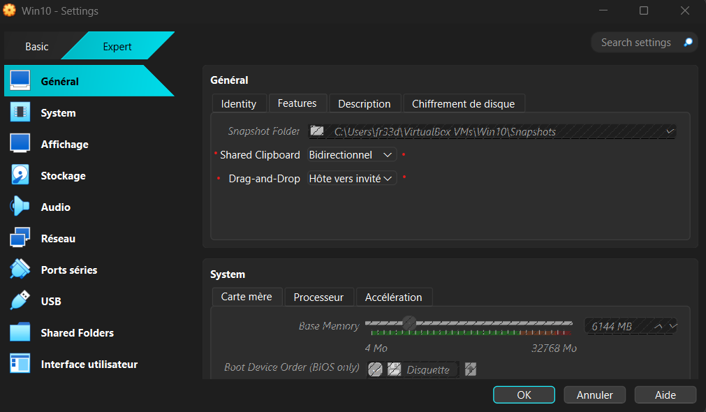
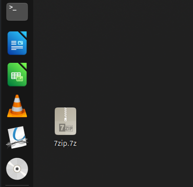
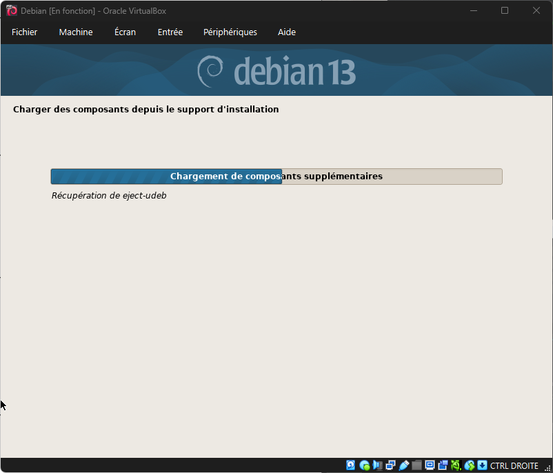
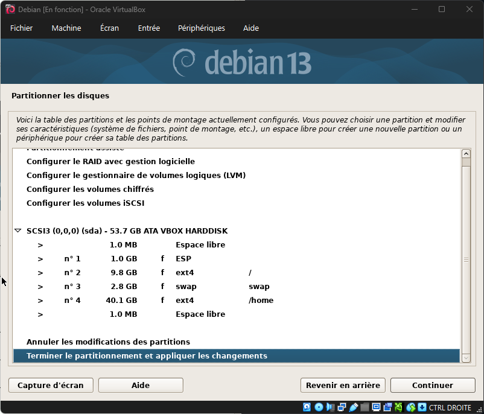

# Challenge 0106 13/10/2025

## Pitch de l’exercice 🧑‍🏫

- En priorité, terminez l’atelier de Vendredi ! (y compris les bonus, si possible)
- C’est à dire : installez Ubuntu et les logiciels demandés dessus !
- Activez le copier/coller entre vos VMs et votre système hôte (petit indice : il faudra regarder du coté des « Additions Invité » de Virtual Box 😉 une petite recherche sur Internet (ou avoir écouté votre super formateur) devrait vous permettre de trouver comment faire !)
- Bonus: Installer une 4ème VM avec le système d’exploitation Debian 13 !

---

## Virtual Box Guest Additions 💽

- Activation dans les paramètres du copier/coller et glisser/déposer sur les VM Windows 10 et 11 après avoir installé les Additions invités via le Disque "VirtualBox Guest Additions" monté dans les périphériques. Elles permettent en plus de resize la fenêtre de la VM en fonction de l'hôte.

## Ubuntu 🐧

- J'ai voulu commencer par les Additions Invités mais au lancement du disque j'ai eu ce message d'erreur

- Correction de cette erreur avec cette commande pour réinstaller de force les outils manquants.

``sudo apt install --reinstall bzip2 tar``

- Installation du reste des applications à l'aide de commandes via le terminal pour la plupart.

- Installation d'Okular, un outil PDF qui remplace Adobe Acrobat sur Linux, même si à priori Libre Office Draw permet de faire les basiques. Adobe Acrobat n'étant plus du tout suivit depuis des années, va aussi à l'encontre de la mentalité Linux et l'Open source.

## Debian 🐧

- Création de la VM à partir de l'image fournie ``debian-13.1.0-amd64-netinst.iso`` avec 4096Mo de Ram, 30Go d'espace disque et 2 CPU core.

- Ajout d'une partition Home séparée.

- Installation de Vbox Guest Additions en chargeant l'image, lancement de l'executable, puis reboot et config, sans problème.

- Vérification et des programmes demandés avec la commande ``sudo apt list grep 7zip vlc okular libreoffice``

- Installation des packages manquants.

- Vérification.

- C'est OOoookkkk ^^

## Notes 🗒️

N'étant pas familier de linux j'ai voulu comprendre les commandes utilisées :

- ``sudo`` Super Utilisateur DO pour exécuter avec les droits admin

- ``apt`` Advanced Packaging Tool pour gérer les paquets (update upgrade install remove) ``sudo apt update`` ``sudo apt upgrae``

- ``ls`` List ``ls /`` liste racine, ``lsbk`` : liste partitions

- ``man`` Donne la liste des commandes, par exemple ``man ls`` donne toutes les commandes possibles de List

- ``tar`` Tape ARchiver, utilitaire pour regrouper des fichiers

- ``bzip2`` algo de compression

- ``grep`` g/re/p : globally search for a regular expression and print, est un outil de Linux pour faire des recherches spécifiques.

Pour les partitions :

- ``/`` partition racine là ou le système s'installe, 50Go mini pour les dernières versions d'Ubuntu par ex

- ``/boot`` 1 à 2 Go, aide le système à démarrer, on y trouve la partition ``/efi``

- ``/swap`` partition d'échange, extention de la RAM si elle est full pour ne pas freeze, ou pour l'hibernation (dans ce cas elle doit faire 1x à 1,5x la taille de notre RAM)

- ``/home`` optionnel mais très recommandé, c'est comme avoir un second disque data pour garder nos données si le système crash ou réinstall ou utilisation multi OS
