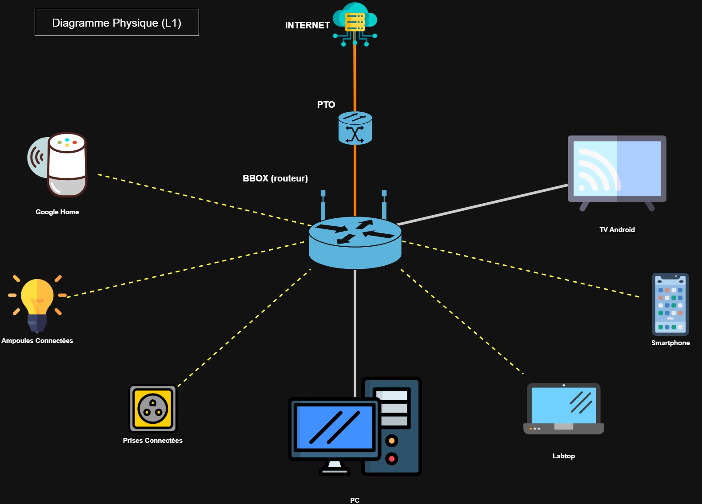
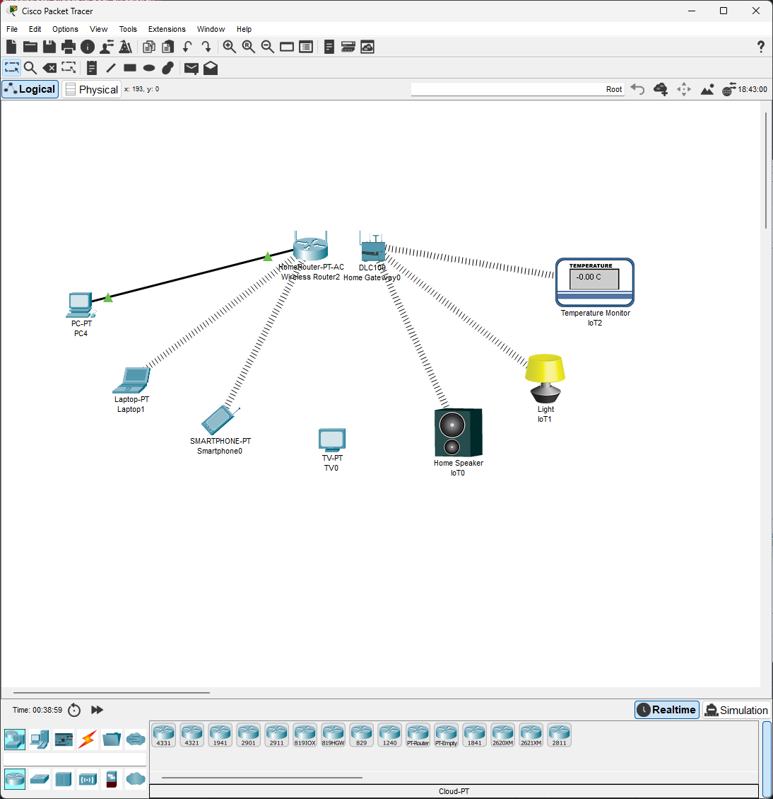

# Challenge 0108 15/10/2025

## Pitch de l’exercice 🧑‍🏫

- Avec l’outil de votre choix (draw.io, par exemple) tentez de réaliser un diagramme réseau de votre réseau domestique.

- Essayez de n’oublier aucun équipement connecté au WiFi ou en filaire à votre box !

- Bonus : vous pouvez aussi commencer à votre renseigner sur les adresses IP et le calcul de sous-réseaux. Il y a plein de vidéos qui traitent de ce sujet sur YouTube 😉

## Diagrammes 📊

- Le Diagramme Physique, représente le Layer 1 du modèle OSI, quels appareils sont physiquement présents et leur emplacement dans les pièces du logement. `"Où sont les choses et comment sont-elles branchées ?"`.

Dans mon cas étant dans un studio il n'y a pas de réel interêt : tout est dans la même pièce.

- Le Diagramme Logique, représente le Layer 3 du modèle OSI,  il montre comment les appareils communiquent entre eux. C'est une vue de haut avec les informations réseau utiles, comme les adresses IP et les sous-réseaux. `"Qui parle à qui et comment ?"`.

Pour simplifier les diagrammes j'ai regroupé les appareils redondants (comme les ampoules en double et prise en triple).

J'ai inclu le PTO (Point de Terminaise Optique) qui est le dernier point physique dans l'appartement, mais je ne suis pas sûr qu'on doive l'afficher en général.

## Essai 🤷

J'ai commencé à vouloir faire l'exercice sur Cisco Packet Tracer, mais ce n'est pas du tout optimal pour un simple Diagramme, devoir confgurer tout les équipements, ou ne pas tout trouver (notament les IoT).

## Les adresses IP et le calcul de sous-réseaux 🧮

[Adresse IP et Masques de sous-réseaux en 5min](https://www.youtube.com/watch?v=dCWDq2Ty00g)

[Masques de sous-réseaux](https://www.youtube.com/watch?v=3Scbl-D5rpM)

[Masques et méthode de Calcul](https://www.youtube.com/watch?v=4dOzT9sTlz8)
