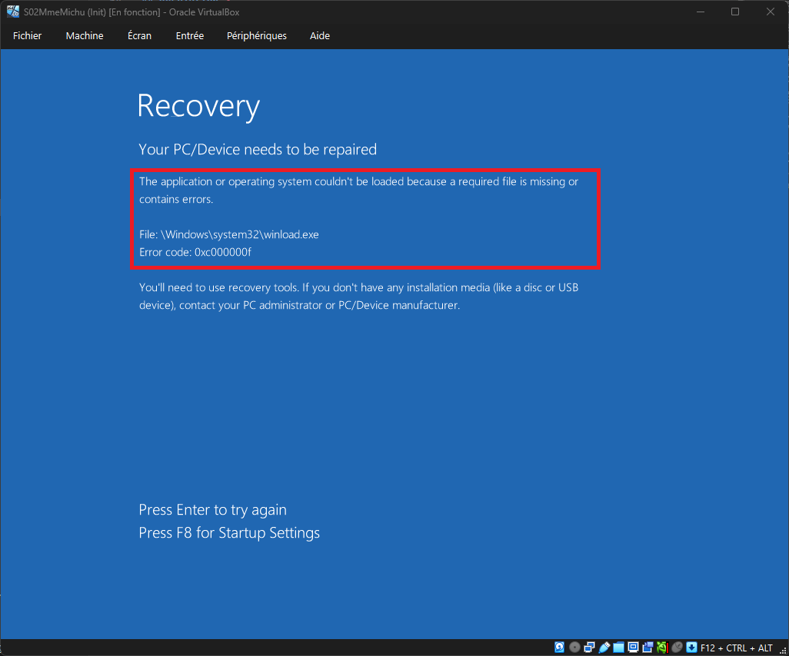
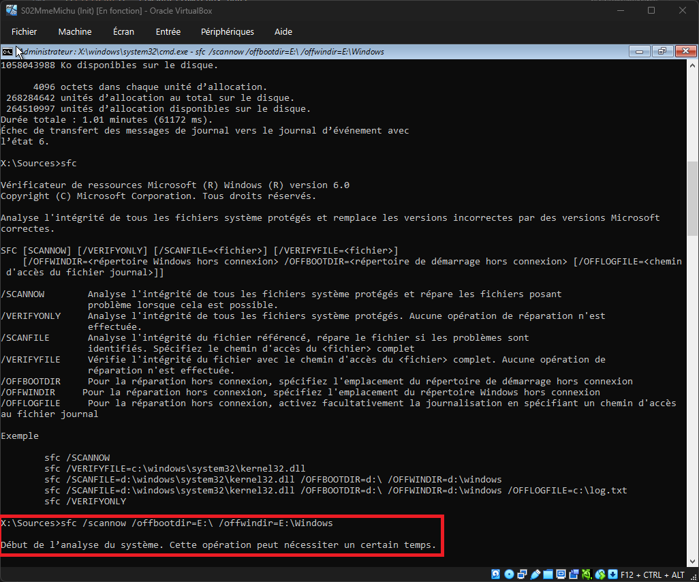
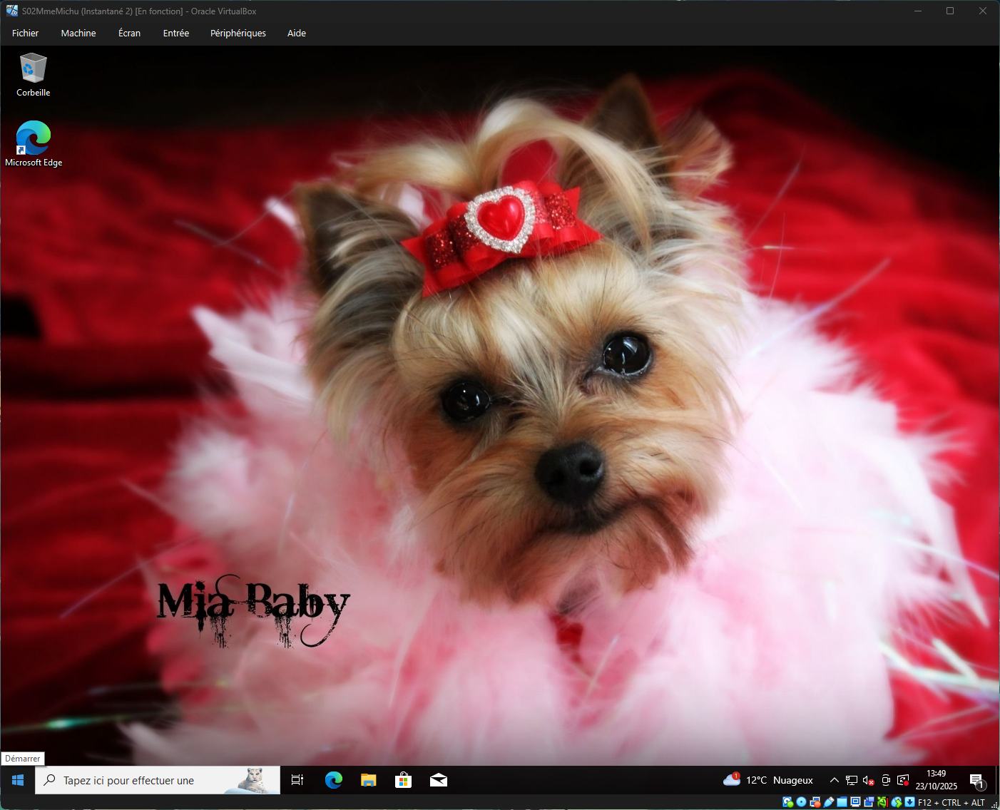
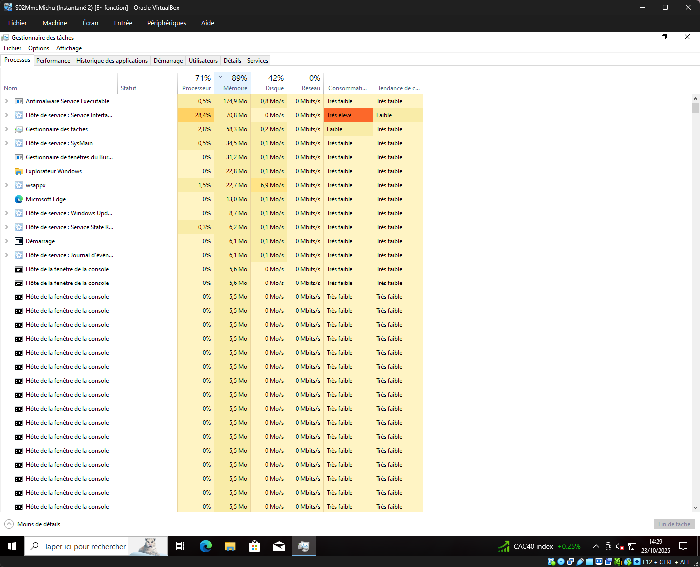
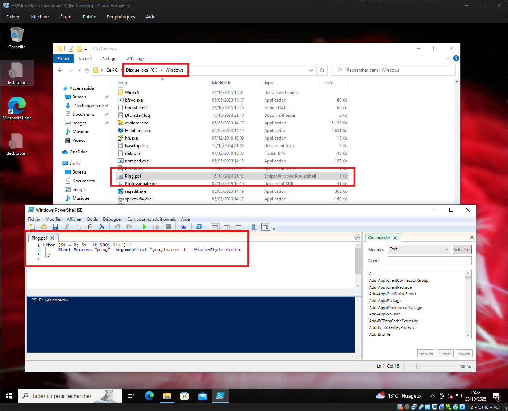
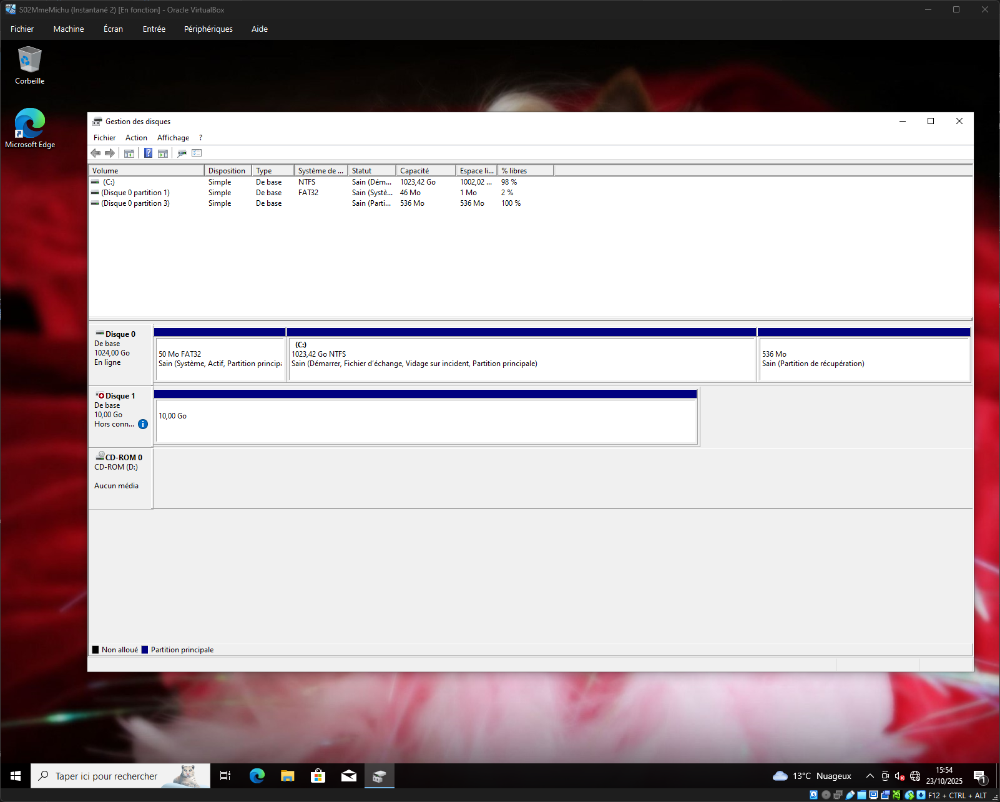
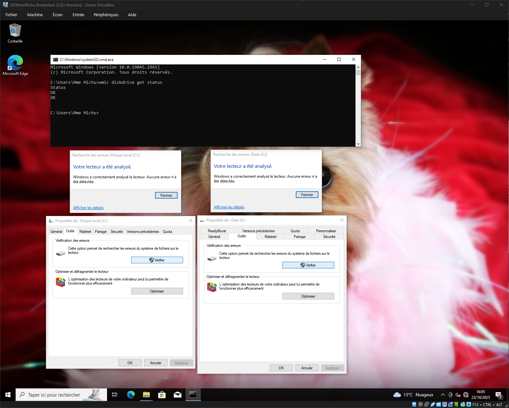
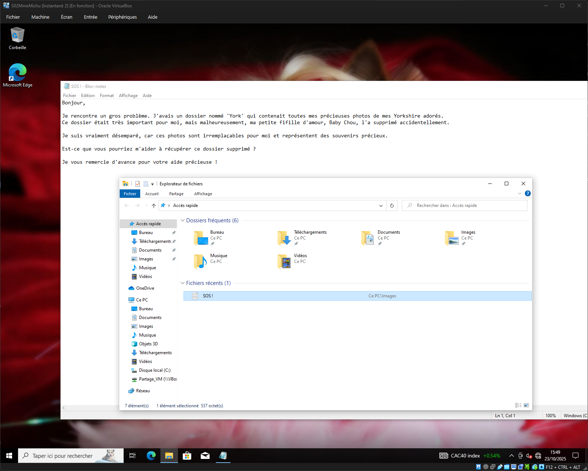
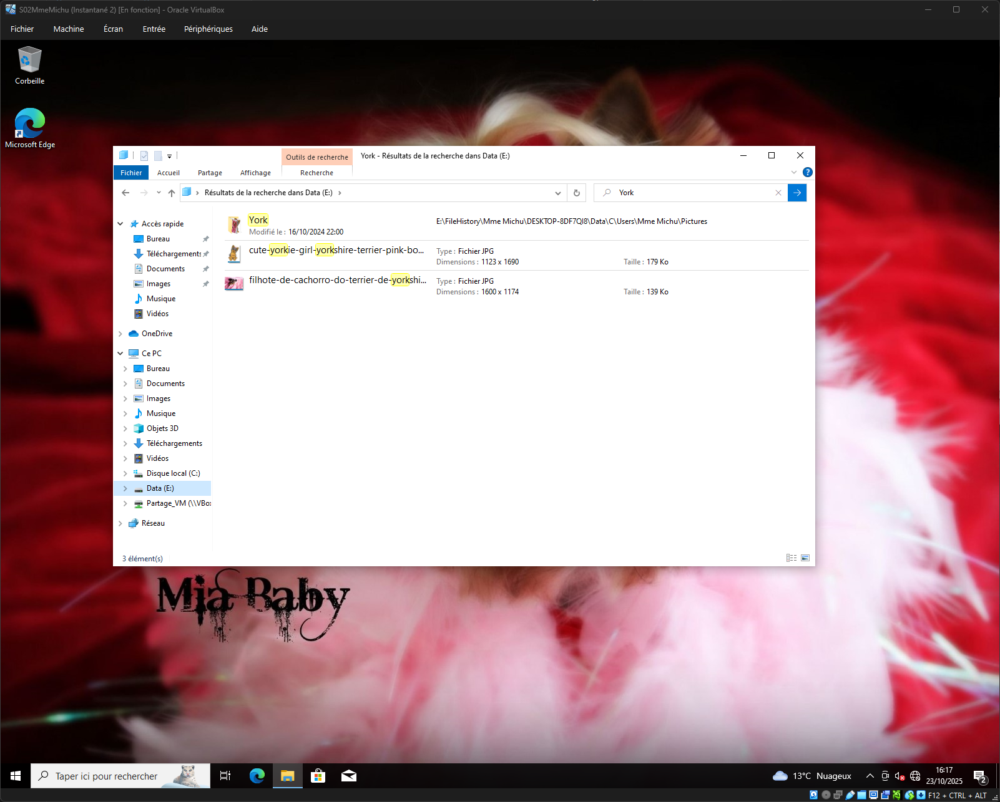
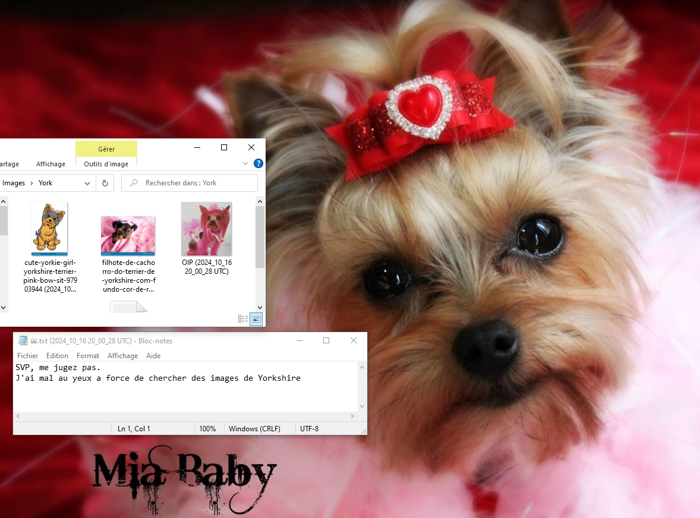

# Challenge 0204 23/10/2025

## Pitch de l’exercice 🧑‍🏫

⌨️ Atelier "Mme Michu"

Hello 👋

Aujourd’hui, tu vas devoir **diagnostiquer et résoudre plusieurs pannes** sur l’ordinateur de *Madame Michu*, une utilisatrice âgée sympathique qui adore les Yorkshires.

Voici le message qu’elle t’as envoyé :

> Bonjour,
> Mon ordinateur ne veut plus démarrer correctement, et quand j’arrive enfin sur le Bureau, mon processeur et ma RAM sont utilisés à 100% (elle est balaise, Mme Michu, pour le pré-diagnostic). En plus, j’ai remarqué que des fichiers dans mon dossier « Images » ont disparu ! Je suis inquiète pour l’état de mes disques durs aussi, il parait qu’ils sont défectueux, pourrais-tu les vérifier aussi ?
> Merci beaucoup de ton aide !

Ta mission est de diagnostiquer et corriger les différentes pannes présentes sur la machine de Madame Michu en suivant ces quatre étapes :

1. Réparer le démarrage de Windows,
2. Restaurer les performances normales de la machine,
3. Vérifier l’état des disques durs,
4. Retrouver les fichiers disparus dans le dossier « Images ».

Vu que ce serait contraignant de vous envoyer le PC de Mme Michu par la poste, on va travailler sur une machine virtuelle VirtualBox. Télécharge-la [ici](https://drive.google.com/drive/u/0/folders/1gFLf4c9vBFUtFSUy1Q04AFhvRddjFzzH) au format OVA et commence ta mission 💪

Tu n’auras pas besoin de mot de passe que ce soit pour lancer le fichier OVA ou pour la session de Madame Michu.

Prends ton temps et suis les étapes dans l’ordre !

## Documentation

N’hésite pas à documenter chaque étape pour faire un retour détaillé à ton formateur et expliquer les actions que tu as effectuées.

Cela permettra aussi de bien comprendre l’origine des pannes et de fournir à Madame Michu un rapport complet. (PS: Pas indispensable pour l’atelier, mais ça peut être un bon entrainement !)

Bon courage et bonne résolution de pannes 💪

## Étape 1 : Réparer le démarrage de Windows

Problème rencontré : L’ordinateur de Madame Michu refuse de démarrer correctement, avec des messages tels que « BootMGR est manquant » ET « Winload.exe introuvable », son petit-fils a testé des trucs, donc il n’y a plus les messages mais le problème est le même, donc ne t’en fais pas si tu ne vois pas les mêmes messages !

Si je peux te donner un conseil, fais attention aux partitions et également au lecteur, si tu avances dans ton diagnostic, peut-être que tu vas t’emmêler les pinceaux avec le C: D: E: F: G: etc… donc prends le temps de bien repérer ton lecteur !

Résous ce problème pour permettre à Windows de démarrer normalement.

## Étape 2 : Restaurer les performances normales de la machine

Problème rencontré : Une fois sur le Bureau, Madame Michu constate que son processeur et sa RAM sont utilisés à 100 %, rendant l’ordinateur très lent.

Diagnostique et résous ce problème pour restaurer les performances optimales.

Il y a plusieurs solutions je pense, mais si tu arrives à restaurer les performances de son PC, l’étape est réussie !

## Étape 3 : Vérifier l’état des disques durs

Problème rencontré : Madame Michu s’inquiète de l’état de ses disques durs. Oui, elle a 2 disques d’après ce qu’elle m’a dit, à vérifier donc si tout va bien de ce côté-là.

Vérifie les disques pour détecter d’éventuels problèmes et corrige-les si nécessaire.

## Étape 4 : Retrouver les fichiers disparus dans le dossier « Images »

Problème rencontré : Des fichiers ont mystérieusement disparu dans le dossier « Images » de Madame Michu.

Retrouve et restaure ces fichiers pour elle.

---

## Résolution 📞

Ayant récupéré le PC de Mme Michu je vais pouvoir commencer à diagnostiquer les problèmes.

### Étape 1 : Réparer le démarrage de Windows 🛠️

Au lancement, voici l'écran qui s'affiche :

On m'a précisé que « BootMGR est manquant » et « Winload.exe introuvable », c'est donc que le BootManager qui lance le Winloaderr est introuvable (problème 1) et le Winload pour lancer Windows correctement l'est aussi (problème 2).

Je vais donc insérer un disque Windows pour boot dessus et fixer le problème de BootMGR en premier.

Je lance l'utilitaire de réparation.

J'ai lancé l'Outil de redémarrage pour réparer automatiquement mais sans succès.

J'entre dans le terminal pour afficher la liste de mes disques avec le ``Diskpart`` et ``list disk`` puis ``list vol`` et déterminer lequel est le disque Windows, c'est le disque ``C:`` qui est actuellement assigné à Windows ``"Réservé au système"``, je vois un disque ``D: Data``, je sais que je devrais faire attention à ne surtout pas l'effacer!

Je vais tenter la méthode du Fix Master Boot Record avec les commandes ``bootrec /FixMbr``, ``bootrec /FixBoot``, ``bootrec /RebuildBcd``.

L'accès est refusé, celà vient à priori du type de partitionnement, la commande /fixboot est conçue pour l'ancien système MBR/BIOS et non EFI moderne.

Je vais à nouveau vérifier mes disques et leurs partition avec ``list partition``, chercher la/les partitions EFI sur mes disques.

Je vois que 2 détails m'ont échappé, le format et la taille des partitions, en effet la partition EFI du BootMNG doit être en fat32 pour pouvoir être lu universellement par le BIOS/UEFI, il faut donc la reformater. Les fichiers Windows sont quand à eux dans la partition 2 (E:) et c'est eux qu'on va copier avec bcdboot vers la partition C:

*The command ``bcdboot C:\Windows /s E:`` copies essential boot files from the Windows directory (E:\Windows) to the system partition (C:) and recreates the Boot Configuration Data (BCD) store, which is required for the system to start.*

Une fois ces opérations effectuées, je reboot la machine, et j'arrive sur cet écran bleu. C'est déjà une progression, on sait que le BootMNG est réparé, c'est maintenant l'étape du Winload, qui lui est HS ou introuvable et ne peux donc pas charcher l'OS.

Il va donc falloir réparer les fichiers Windows avec le SFC (System File Checker).

Je relance la machine, je boot sur l'image Windows, j'utilise la commande ``MAF + F10`` pour aller directement à la console et lancer un Check Disk par précaution, pour s'assurer que le disque est sain avant de réparer Windows.

``chkdsk E: /f /r``  /f corrige les erreurs sur le disque.  /r localise les secteurs défectueux et récupère les informations lisibles.

Le checkdisk est un peu long, il m'a laissé le temps de déjeuner ^^

Tout est OK on va pouvoir passer au SFC (System File Checker) pour analyser les fichiers et remplacer ceux qui peuvent être HS comme notre *winload.exe*.

``sfc /scannow /offbootdir=E:\ /offwindir=E:\Windows``

``/scannow`` : C'est l'ordre de scanner et réparer.

``/offbootdir=E:\`` : Indique que le lecteur de démarrage (là où se trouve Windows) est E:.

``/offwindir=E:\Windows`` : Spécifie le chemin exact du dossier Windows à réparer.

SFC à bien détecté et réparé des fichiers corrompus.

Je redémarre la machine et c'est bon, Windows est réparé et load comme il se doit, on tombe sur la session de Mme Michu !

👵 Quel plaisir d'enfin admirer le fond d'écran de Mme Michu !

---

### Étape 2 : Restaurer les performances normales de la machine 🕵️

Mon premier réflexe est d'ouvrir le gestionnaire des taches  ``Crtl + MAJ + Echap`` pour regarder ce qui se passe en fond sur la machine : Analyser les performances et les processus.

Aucun programme seul n'est entrain d'utiliser le processeur à plus de 30%.

Aucun programme seul n'est entrain de saturer la mémoire.

Par contre je me rend compte qu'il y a une quantité anormale de petit processus identiques liés à la Console et à une demande de Ping, qui consomment pas grand chose individuelement mais saturent le système vu la quantité présente !

Je vais voir dans les Détails ce sont : conhost.exe qui est la Console windows, et PING.exe qui n'est pas un processus normal. je comprend donc qu'on a une commande malveillante, surement lancée au démarrage (je me souviens avoir vu apparaitre brievement une console au démarrage).

La machine étant vraiment saturée, je vais dans Démarrage Windows, et je désactive tout ce qui est inutile, et surtout la commande powershell. Je reboot.

Je lance directement le Gestionnaire après le reboot et là on voit que les performances sont bien plus normales.

Je décide donc d'aller voir en détail dans le dossier de démarrage avec la commande ``shell:startup`` et je trouve bien le raccourcit PING.exe qui polluait ma machine au démarrage. J'imagine que c'est une commande malveillante pour lancer des Pings en boucle et saturer la machine. Je me rend compte que j'aurais peut être dû faire ça directement plutôt que d'aller dans les paramètres de Démarrage Windows. Mais ça me laisse maintenant le temps d'analyser ce que c'est.

J'ai demandé à Gemini d'analyser cette commande

*Voici la commande que tu as trouvée dans le raccourci au démarrage : ``C:\Windows\System32\WindowsPowerShell\v1.0\powershell.exe -WindowStyle Hidden -ExecutionPolicy Bypass -File "C:\Windows\Ping.ps1"``*

*Décortiquons-la pour comprendre sa toxicité :*

- *``powershell.exe`` C'est l'outil qui exécute le script. PowerShell est un langage de commande très puissant, bien plus que l'ancienne invite de commandes.*

- *``-WindowStyle Hidden`` C'est la partie la plus vicieuse. Cet argument ordonne à PowerShell de s'exécuter sans aucune fenêtre visible. Mme Michu ne voit absolument rien se passer sur son bureau, pendant que son PC est en train d'être mis à genoux en arrière-plan.*

- *``-ExecutionPolicy Bypass`` C'est un énorme drapeau rouge de sécurité ! Par défaut, Windows empêche l'exécution de scripts non signés pour protéger l'utilisateur. Cet argument dit à PowerShell : "Ignore toutes les règles de sécurité et exécute le script quoi qu'il arrive". C'est comme forcer une porte de sécurité.*

- *``-File "C:\Windows\Ping.ps1"`` C'est le cœur du problème. Cette partie exécute un fichier nommé Ping.ps1. Le fait qu'il soit placé directement dans C:\Windows est une technique classique pour le cacher parmi les milliers de fichiers système légitimes.*

*Que fait le script ``Ping.ps1`` ?
Même sans voir le contenu du fichier, on peut le deviner. Ce script contient très probablement une boucle infinie qui lance en continu la commande ping.exe.*

*Ça ressemble à quelque chose comme ça en PowerShell :*

*``PowerShell
while ($true) {
    Start-Process ping.exe -ArgumentList "une_adresse_ip_cible"
}``*

*Cette boucle tourne sans jamais s'arrêter, lançant des milliers de processus ping.exe jusqu'à ce que le système n'ait plus aucune ressource (CPU, RAM) et se bloque complètement.*

*C'est une forme d'attaque qu'on peut assimiler à une **"Fork Bomb"** : un programme qui se réplique à l'infini pour saturer les ressources d'un ordinateur et le faire planter. Dans ce cas, il ne se réplique pas lui-même, mais il lance un autre programme en boucle.*

Maintenant il ne me reste plus qu'a nettoyer la machine.

- ``shell:startup`` pour ouvrir le dossier de démarrage et supprimer le Lien Malveillant.

- ``C:\Windows`` (le chemin était dans le raccourcit) pour trouver le fichier ``Ping.ps1`` et le supprimer (je l'ai ouvert pour vérifier la commande).

- Relancer au Démarrage Windows antivirus, faire les mises à jour et lancer un scan pour vérifier que tout est OK.

👵 La machine de Mme Michu tourne comme en 40 !

---

### Étape 3 : Vérifier l’état des disques durs 💽

Mme Michu s'inquète de l'état de ses disques durs, mais quand j'ouvre l'explorateur Windows, je ne vois qu'un seul disque, je lance donc l'outil de Gestion des disques pour voir ce qu'il en retourne. Et effectivement je vois bien le Disque 0, mais le Disque 1 est hors connexion.

J'ai juste à faire un click-droit : En Ligne. Il apparait ainsi dans l'explorateur sans problème, je vois qu'il est déjà formaté et partitioné ``DATA E:`` (c'est bien le disque qu'on avait dans le tout premier ``DiskPart : list vol``)

- Vérification **visuelle** des disques : je reboot la machine pour voir si le disque est toujours là. C'est OK

- Vérification **logique** : je lance un ``chddsk`` depuis l'explorateur sur les 2 disques. C'est OK

- Vérification **physique** : je lance ``wmic diskdrive get status`` pour avoir l'état S.M.A.R.T. des disques. C'est OK

👵 Voilà de quoi rassurer Mme Michu sur l'état de ses disques !

---

### Étape 4 : Retrouver les fichiers disparus dans le dossier « Images » 🖼️

Je tombe sur la note ``SOS !`` de Mme Michu dans son dossier Image.

Avec une simple fonction de recherche je retrouve son dossier perdu, je pourrais simplement orienter sa bibliothèque d'image vers cette cible : ``E:\FileHistory\Mme Michu\DESKTOP-8DF7QI8\Data\C\Users\Mme Michu\Pictures`` mais en investiguant un peu cette arborescence je me rend compte que c'est tout le dossier User de Mme Michu qui a été déplacé.

En cherchant un peu sur internet je vois que le dossier ``E:\FileHistory`` avec des fichiers Config XML font parti du mécanisme de sauvegarde **"Historique des Fichiers"** de Windows.

Je devrais pouvoir donc lui restaurer ça proprement. Je vais ``copier`` tout le contenu de :

 ``E:\FileHistory\Mme Michu\DESKTOP-8DF7QI8\Data\C\Users\Mme Michu``

vers :

``C:\Users\Mme Michu``

ainsi tout son dossier utilisateur retrouve les données perdues.

---

### Mon analyse de ce qui a pu se passer 🧠

- Mme Michu ouvre un mail avec des photos de York sans vérifier qui lui a envoyé 👵

- Le script malveillant sature le Proc et la RAM de Mme Michu 🦠

- Face à son ordinateur bloqué Mme Michu tente de l'éteindre, par exemple en laissant appuyer sur le bouton de démarrage pendant 5 sec (HardShutdown) ou en coupant l'alimentation. 💥

- Cet arrêt brutal en plein "travail" a pu endommager l'écriture sur le disque et corrompre le secteur de démarrage : BootMNG, le secteur de fichiers Windows systèmes : Winload ainsi que le profil utilisateur, obligeant Windows à en créer un nouveau, vierge. 🧨

- Coup de chance pour Mme Michu, l'Historique des fichier avait du être activé et avait pu les sauvegarder sur le disque DATA E: 🍀

---

### Quel discours tenir en rendant l'ordinateur à Mme Michu 👵

*"Bonjour Madame Michu, j'ai une excellente nouvelle, votre ordinateur est de nouveau en pleine forme ! Je vous l'ai nettoyé et tout est rentré dans l'ordre.*

*Je vais vous expliquer simplement ce qui s'est passé. Votre ordinateur était devenu extrêmement lent à cause d'un petit programme malveillant, une sorte de parasite, qui s'était installéet forçait votre ordinateur à faire des milliers de petites tâches inutiles en même temps, sans que vous ne le voyiez.*

*Comme il était totalement bloqué, j'imagine que vous avez dû le forcer à s'éteindre. C'est un bon réflexe, mais cet arrêt un peu brusque a un peu "brouillé" le démarrage de Windows. C'est pour ça qu'il ne voulait plus se lancer du tout et qu'il vous affichait un message d'erreur.*

*J'ai d'abord réparé le démarrage de Windows pour qu'il puisse se lancer à nouveau.*

*Ensuite, j'ai trouvé et supprimé définitivement ce fameux parasite qui le ralentissait.*

*Enfin, j'ai fait une vérification complète du système, des disques et j'ai installé toutes les dernières mises à jour de sécurité.*

*Et maintenant, la meilleure nouvelle ! Je sais que vous étiez très inquiète pour vos photos. Lorsque Windows a eu son problème de démarrage, il a supprimé votre profil utilisateur.
Heureusement, vous aviez une sauvegarde automatique sur votre deuxième disque dur. J'ai pu tout récupérer. Vos magnifiques photos de Yorkshires sont bien là, en sécurité dans votre dossier "Images", comme avant.*

*Pour finir, juste deux petits conseils pour l'avenir :*

*Faites bien attention aux pièces jointes dans les e-mails et aux programmes que vous téléchargez sur des sites inconnus, c'est souvent par là que ces parasites arrivent.*

*Pensez toujours à éteindre l'ordinateur via le menu Démarrer et le bouton "Arrêter".*

*Voilà, il est maintenant propre, rapide et sécurisé. N'hésitez surtout pas à m'appeler si vous avez la moindre question !"**

---

---
